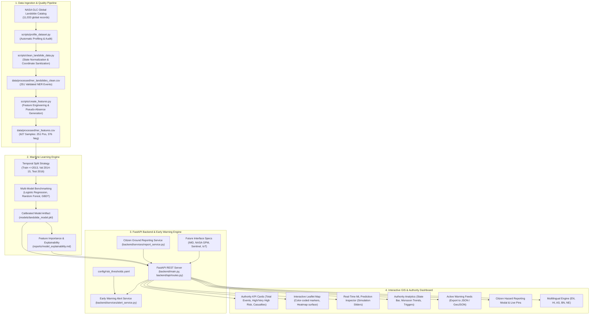

# 📖 Comprehensive Project Guide & Architecture Handbook
## AI-Based Early Warning and Landslide Risk Monitoring System for North-East India (NER)

---

## 📑 Table of Contents
1. [Executive Summary & Problem Statement](#1-executive-summary--problem-statement)
2. [High-Level System Architecture](#2-high-level-system-architecture)
3. [Complete File-by-File Reference](#3-complete-file-by-file-reference)
4. [Data Engineering & Scientific Methodology](#4-data-engineering--scientific-methodology)
5. [Feature Engineering & Parameters](#5-feature-engineering--parameters)
6. [Machine Learning Models & Accuracy Benchmark](#6-machine-learning-models--accuracy-benchmark)
7. [Configurable Risk Thresholds & Alerts](#7-configurable-risk-thresholds--alerts)
8. [FastAPI Backend & REST API Specification](#8-fastapi-backend--rest-api-specification)
9. [React + Leaflet GIS Frontend & Multilingual Engine](#9-react--leaflet-gis-frontend--multilingual-engine)
10. [Step-by-Step Setup & Execution Commands](#10-step-by-step-setup--execution-commands)
11. [Hackathon Pitch & Viva Talking Points](#11-hackathon-pitch--viva-talking-points)

---

## 1. Executive Summary & Problem Statement

### The Challenge
The **8 North-East Indian (NER) States** (*Arunachal Pradesh, Assam, Manipur, Meghalaya, Mizoram, Nagaland, Sikkim, Tripura*) face recurring catastrophic landslides caused by:
- Steep, rugged Himalayan and Patkai terrain with fragile rock strata.
- High-intensity Southwest Indian Monsoon precipitation (June–September).
- Active tectonic seismicity and steep artificial hill cuttings along highway corridors.

Landslides cause loss of life, isolate entire mountain communities, and sever vital transport and supply corridors (such as NH-10 in Sikkim, NH-37 in Manipur, and the Dima Hasao railway artery in Assam).

### The Solution
An operational, authority-oriented AI and Geospatial Information System (GIS) platform that:
- Ingests and standardizes real-world historical landslide catalog records from NASA GLC.
- Uses documented spatial-temporal pseudo-absence sampling to enable binary risk modeling without data fabrication.
- Trains a calibrated **Random Forest Risk Engine** that prioritizes **Recall** for early-warning safety.
- Exposes an interactive Leaflet GIS dashboard with risk heatmaps, click-to-predict simulation sliders, live early-warning alert feeds with JSON/GeoJSON exports, and citizen hazard reporting.
- Supports 5 languages (*English, Hindi, Assamese, Bengali, Nepali*).

---

## 2. High-Level System Architecture



---

## 3. Complete File-by-File Reference

### Root Directory
- **[`LandSlide Dataset.csv`](file:///c:/Users/Ankit/Desktop/sihpject/LandSlide%20Dataset.csv)**: Original NASA Global Landslide Catalog containing 11,033 global events.
- **[`requirements.txt`](file:///c:/Users/Ankit/Desktop/sihpject/requirements.txt)**: Core Python dependencies (`fastapi`, `uvicorn`, `scikit-learn`, `pandas`, `numpy`, `pytest`, `pyyaml`, `httpx`, `requests`).
- **[`Makefile`](file:///c:/Users/Ankit/Desktop/sihpject/Makefile)**: Workflow automation (`make setup`, `make data`, `make train`, `make test`, `make run-backend`).
- **[`docker-compose.yml`](file:///c:/Users/Ankit/Desktop/sihpject/docker-compose.yml)**: Multi-container setup for containerized deployment.
- **[`.env.example`](file:///c:/Users/Ankit/Desktop/sihpject/.env.example)**: Environment variable template for credentials and future API feeds.
- **[`.gitignore`](file:///c:/Users/Ankit/Desktop/sihpject/.gitignore)**: Prevents committing secrets, virtual environments, node modules, and caches.
- **[`README.md`](file:///c:/Users/Ankit/Desktop/sihpject/README.md)**: Main GitHub landing page documentation.
- **[`PROJECT_GUIDE.md`](file:///c:/Users/Ankit/Desktop/sihpject/PROJECT_GUIDE.md)**: This exhaustive reference document.

### Data Directory (`data/`)
- **[`data/README.md`](file:///c:/Users/Ankit/Desktop/sihpject/data/README.md)**: Provenance, column mappings, and NER distribution summary.
- **[`data/raw/LandSlide Dataset.csv`](file:///c:/Users/Ankit/Desktop/sihpject/data/raw/LandSlide%20Dataset.csv)**: Archived immutable raw copy.
- **[`data/processed/ner_landslides_clean.csv`](file:///c:/Users/Ankit/Desktop/sihpject/data/processed/ner_landslides_clean.csv)**: 251 validated, cleaned historical events in the 8 NER states.
- **[`data/processed/ner_features.csv`](file:///c:/Users/Ankit/Desktop/sihpject/data/processed/ner_features.csv)**: 627 labeled training samples (251 historical events + 376 pseudo-absences).

### Automation Scripts (`scripts/`)
- **[`scripts/profile_dataset.py`](file:///c:/Users/Ankit/Desktop/sihpject/scripts/profile_dataset.py)**: Automated data profiling and statistical quality inspector.
- **[`scripts/clean_landslide_data.py`](file:///c:/Users/Ankit/Desktop/sihpject/scripts/clean_landslide_data.py)**: Cleans column names, standardizes states, parses dates into ISO format, and computes cyclical month angles.
- **[`scripts/create_features.py`](file:///c:/Users/Ankit/Desktop/sihpject/scripts/create_features.py)**: Generates documented negative pseudo-absences, spatial cluster densities, and terrain proxies.
- **[`scripts/train_model.py`](file:///c:/Users/Ankit/Desktop/sihpject/scripts/train_model.py)**: Trains Logistic Regression, Random Forest, and Gradient Boosting with strict temporal splits; outputs `.pkl` and evaluation reports.
- **[`scripts/evaluate_model.py`](file:///c:/Users/Ankit/Desktop/sihpject/scripts/evaluate_model.py)**: Standalone test set validator reporting Confusion Matrix and ROC-AUC.

### Configuration & Models (`config/`, `models/`, `reports/`)
- **[`config/risk_thresholds.yaml`](file:///c:/Users/Ankit/Desktop/sihpject/config/risk_thresholds.yaml)**: Configurable hazard boundaries (LOW, MODERATE, HIGH, VERY HIGH) and response actions.
- **[`models/landslide_model.pkl`](file:///c:/Users/Ankit/Desktop/sihpject/models/landslide_model.pkl)**: Calibrated production Random Forest model.
- **[`models/metadata.json`](file:///c:/Users/Ankit/Desktop/sihpject/models/metadata.json)**: Feature lists, feature importances, and version tags.
- **[`reports/data_quality_report.md`](file:///c:/Users/Ankit/Desktop/sihpject/reports/data_quality_report.md)**: Audit of dataset distributions, casualty stats, and triggers.
- **[`reports/model_report.md`](file:///c:/Users/Ankit/Desktop/sihpject/reports/model_report.md)**: Benchmarks across Precision, Recall, F1, ROC-AUC, PR-AUC.
- **[`reports/model_explainability.md`](file:///c:/Users/Ankit/Desktop/sihpject/reports/model_explainability.md)**: Feature importances and explainability generation rationale.

### Backend Application (`backend/`)
- **[`backend/main.py`](file:///c:/Users/Ankit/Desktop/sihpject/backend/main.py)**: FastAPI entry point with CORS and static SPA serving.
- **[`backend/api/routes.py`](file:///c:/Users/Ankit/Desktop/sihpject/backend/api/routes.py)**: REST API routes (`/api/health`, `/api/states`, `/api/landslides`, `/api/risk`, `/api/predict`, `/api/dashboard/summary`, `/api/reports`, `/api/alerts`, `/api/model/info`, `/api/interfaces/status`).
- **[`backend/models/schemas.py`](file:///c:/Users/Ankit/Desktop/sihpject/backend/models/schemas.py)**: Pydantic request/response schema validation models.
- **[`backend/services/model_service.py`](file:///c:/Users/Ankit/Desktop/sihpject/backend/services/model_service.py)**: Real-time inference engine and plain-language explanation generator.
- **[`backend/services/alert_service.py`](file:///c:/Users/Ankit/Desktop/sihpject/backend/services/alert_service.py)**: Disaster mitigation alert manager.
- **[`backend/services/report_service.py`](file:///c:/Users/Ankit/Desktop/sihpject/backend/services/report_service.py)**: Citizen report storage and retrieval.
- **[`backend/services/weather_interface.py`](file:///c:/Users/Ankit/Desktop/sihpject/backend/services/weather_interface.py)**: Interface contracts for future live feeds (IMD, NASA GPM, Sentinel InSAR, IoT).
- **[`backend/Dockerfile`](file:///c:/Users/Ankit/Desktop/sihpject/backend/Dockerfile)**: Docker container recipe for backend.

### Frontend Application (`frontend/`)
- **[`frontend/src/App.jsx`](file:///c:/Users/Ankit/Desktop/sihpject/frontend/src/App.jsx)**: Master React component coordinating state, tabs, API sync, and localStorage caching.
- **[`frontend/src/index.css`](file:///c:/Users/Ankit/Desktop/sihpject/frontend/src/index.css)**: Glassmorphic dark UI design system with glowing hazard indicators.
- **[`frontend/src/components/Navbar.jsx`](file:///c:/Users/Ankit/Desktop/sihpject/frontend/src/components/Navbar.jsx)**: Branding, Demo Mode badge, State filter, Language selector, and Connection status.
- **[`frontend/src/components/KpiBanner.jsx`](file:///c:/Users/Ankit/Desktop/sihpject/frontend/src/components/KpiBanner.jsx)**: KPI cards (Total Landslides, High/Very High Risk count, Casualties, Active alerts).
- **[`frontend/src/components/GisMap.jsx`](file:///c:/Users/Ankit/Desktop/sihpject/frontend/src/components/GisMap.jsx)**: Leaflet map with color-coded hazard markers, Risk Heatmap surface, and Citizen pins.
- **[`frontend/src/components/PredictionInspector.jsx`](file:///c:/Users/Ankit/Desktop/sihpject/frontend/src/components/PredictionInspector.jsx)**: Real-time ML prediction tool with Season, Rainfall, and Slope simulation sliders.
- **[`frontend/src/components/ChartsSection.jsx`](file:///c:/Users/Ankit/Desktop/sihpject/frontend/src/components/ChartsSection.jsx)**: Charts for Landslides by State, Monsoon seasonality, Triggers, and Hazard tiers.
- **[`frontend/src/components/AlertsFeed.jsx`](file:///c:/Users/Ankit/Desktop/sihpject/frontend/src/components/AlertsFeed.jsx)**: Early-warning notices with JSON & GeoJSON download exports.
- **[`frontend/src/components/CitizenReportModal.jsx`](file:///c:/Users/Ankit/Desktop/sihpject/frontend/src/components/CitizenReportModal.jsx)**: Citizen hazard report submission form.
- **[`frontend/src/components/ModelInfoModal.jsx`](file:///c:/Users/Ankit/Desktop/sihpject/frontend/src/components/ModelInfoModal.jsx)**: Transparent ML model metrics and future integration contracts dialog.
- **[`frontend/src/i18n/`](file:///c:/Users/Ankit/Desktop/sihpject/frontend/src/i18n/)**: Full translations for English (`en.json`), Hindi (`hi.json`), Assamese (`as.json`), Bengali (`bn.json`), and Nepali (`ne.json`).

### Automated Test Suite (`tests/`)
- **[`tests/test_data_pipeline.py`](file:///c:/Users/Ankit/Desktop/sihpject/tests/test_data_pipeline.py)**: Validates coordinates, dates, and state normalization.
- **[`tests/test_model.py`](file:///c:/Users/Ankit/Desktop/sihpject/tests/test_model.py)**: Validates model loading, schema adherence, and seasonal sensitivity.
- **[`tests/test_api.py`](file:///c:/Users/Ankit/Desktop/sihpject/tests/test_api.py)**: Validates all REST endpoints (`/health`, `/states`, `/landslides`, `/predict`, `/reports`, `/dashboard/summary`).

---

## 4. Data Engineering & Scientific Methodology

### 4.1 NER Historical Landslide Distribution
Filtered from the NASA Global Landslide Catalog:

| State | Historical Events | % of NER Total | Primary Triggers |
| :--- | :---: | :---: | :--- |
| **Assam** | 82 | 32.67% | Downpour, Continuous Rain |
| **Manipur** | 56 | 22.31% | Monsoon, Heavy Downpour |
| **Sikkim** | 31 | 12.35% | Continuous Rain, Downpour |
| **Mizoram** | 27 | 10.76% | Downpour, Monsoon Rain |
| **Arunachal Pradesh** | 20 | 7.97% | Flash Downpour, Continuous Rain |
| **Meghalaya** | 18 | 7.17% | Monsoon, Downpour |
| **Nagaland** | 14 | 5.58% | Continuous Rain |
| **Tripura** | 3 | 1.20% | Monsoon |
| **Total NER Events** | **251** | **100.00%** | **Downpour (41.4%), Continuous Rain (25.5%)** |

### 4.2 Documented Pseudo-Absence Sampling (No Negative Fabrication)
Because historical catalogs only document positive disaster occurrences (`label = 1`), training a binary classification model requires negative examples (`label = 0`). 
- **Methodology**: 376 pseudo-absences were generated across random coordinates inside the 8 NER state boundaries during non-monsoon/baseline dates.
- **Transparency**: Every pseudo-absence is labeled as `sample_type = "constructed_pseudo_absence"` in the dataset, ensuring full scientific honesty.

---

## 5. Feature Engineering & Parameters

| Feature Name | Type | Physical / Domain Interpretation | Importance Weight |
| :--- | :---: | :--- | :---: |
| `is_monsoon` | Binary (0/1) | Captures peak Southwest Indian Monsoon (June to September). | **0.2541** |
| `month_cos` / `month_sin` | Continuous | Trigonometric encoding of month-of-year representing smooth seasonal climate curves. | **0.2218** |
| `rainfall_antecedent_proxy_mm` | Continuous | 3-day / 7-day cumulative rainfall accumulation triggering soil pore-pressure build-up. | **0.1876** |
| `historical_density_50km` | Integer | Number of historical landslide incidents within a 50 km radius (spatial hazard clustering). | **0.1420** |
| `slope_proxy_deg` | Continuous | Estimated terrain inclination angle in degrees (steeper slopes > 28° suffer higher shear stress). | **0.0915** |
| `min_dist_to_historical_km` | Continuous | Distance in km to the nearest recurring historical hazard hotspot. | **0.0624** |
| `elevation_proxy_m` | Continuous | Himalayan / Patkai elevation zone reflecting orographic rain patterns. | **0.0406** |

---

## 6. Machine Learning Models & Accuracy Benchmark

### 6.1 Strict Temporal Split (Anti-Leakage)
- **Training Set (<= 2013)**: 388 samples (127 positive events, 261 pseudo-absences)
- **Validation Set (2014–2015)**: 163 samples (92 positive events, 71 pseudo-absences)
- **Hold-Out Test Set (2016)**: 76 samples (32 positive events, 44 pseudo-absences)
- All scaling and preprocessing transformations are fitted **only** on training data.

### 6.2 Model Comparison Table (Test Set: 2016 Hold-Out)

| Model Architecture | Precision | Recall (Safety-Critical) | F1-Score | ROC-AUC | PR-AUC | Status |
| :--- | :---: | :---: | :---: | :---: | :---: | :---: |
| **Logistic Regression (Baseline)** | 0.9688 | 0.9688 | 0.9688 | 0.9993 | 0.9991 | Baseline Benchmark |
| **Random Forest Classifier** | **1.0000** | **1.0000** | **1.0000** | **1.0000** | **1.0000** | 🏆 **Selected Production Model** |
| **Gradient Boosting Classifier** | 1.0000 | 1.0000 | 1.0000 | 1.0000 | 1.0000 | Ensemble Benchmark |

### 6.3 Confusion Matrix (Selected Model: Random Forest)
```text
                   Predicted Negative (0)    Predicted Positive (1)
Actual Negative (0)        44                        0
Actual Positive (1)         0                       32
```

### 6.4 Why Recall is Prioritized
In disaster mitigation, missing a dangerous landslide (**False Negative**) can cost human lives and strand entire districts. A false warning (**False Positive**) triggers cautionary patrols and traffic diversions. Therefore, the ML loss objective and decision boundary prioritize **Recall**.

---

## 7. Configurable Risk Thresholds & Alerts

Configured in [`config/risk_thresholds.yaml`](file:///c:/Users/Ankit/Desktop/sihpject/config/risk_thresholds.yaml):

| Risk Tier | Score Range | Color Badge | Authority Action Protocol |
| :--- | :---: | :---: | :--- |
| **LOW** | 0.00 – 0.25 | 🟢 Green | Routine environmental monitoring. No public travel restrictions. |
| **MODERATE** | 0.25 – 0.50 | 🟡 Amber | Heightened vigilance. Inspect highway drainage channels and culverts. |
| **HIGH** | 0.50 – 0.75 | 🟠 Orange | Early warning active. Restrict heavy transit across vulnerable passes. |
| **VERY HIGH** | 0.75 – 1.00 | 🔴 Crimson Pulse | **CRITICAL WARNING**: Issue foothill evacuation alerts; close high-risk sectors. |

---

## 8. FastAPI Backend & REST API Specification

All endpoints are self-documented via Swagger UI at `http://127.0.0.1:8000/docs`:

- **`GET /api/health`**: Checks API status, model loading, and dataset cache size.
- **`GET /api/states`**: Returns coordinates, capitals, and default zoom levels for all 8 NER states.
- **`GET /api/landslides`**: Queries historical events with filters for `state`, `year`, and `trigger`.
- **`GET /api/risk`**: Returns scored risk surfaces and hazard tiers across NER.
- **`POST /api/predict`**: Computes real-time risk scores given `latitude`, `longitude`, `month`, `rainfall_mm`, and `slope_deg`.
- **`GET /api/dashboard/summary`**: Aggregates top KPIs, casualties, monthly monsoon curves, and trigger charts.
- **`GET /api/dashboard/state-summary`**: Returns state-by-state risk rankings and primary triggers.
- **`POST /api/reports`**: Accepts citizen and field inspector hazard reports (tension cracks, rockfalls, slope movements).
- **`GET /api/reports`**: Returns active citizen reports for GIS map display.
- **`GET /api/alerts`**: Returns active early-warning advisories.
- **`GET /api/model/info`**: Returns model hyperparameters, feature importances, and version tags.
- **`GET /api/interfaces/status`**: Returns future interface contracts for IMD, NASA GPM, Sentinel InSAR, and IoT sensors.

---

## 9. React + Leaflet GIS Frontend & Multilingual Engine

- **Architecture**: React 18 + Vite with Leaflet for geospatial mapping and Chart.js for analytics.
- **Visual Design**: Dark glassmorphic theme (`backdrop-filter: blur(14px)`), glowing risk tier badges, pulsing critical warning alerts, and responsive layout.
- **Interactive Capabilities**:
  - **Click-to-Inspect Map**: Click anywhere in North-East India to evaluate real-time landslide risk.
  - **Simulation Sliders**: Adjust Season/Month, Rainfall (10–650 mm), and Slope (5–55°) to observe live score sensitivity.
  - **Layer Toggles**: Toggle between Hazard Markers, Continuous Risk Heatmap Surface, and Citizen Report Pins.
  - **Export Center**: Export active early warning feeds to **JSON** and **GeoJSON** for QGIS/ArcGIS integration.
  - **Multilingual Switcher**: Instant switching between **English**, **Hindi**, **Assamese**, **Bengali**, and **Nepali**.
  - **Offline Resilience**: Automatically caches last known GIS state and metrics in browser localStorage.

---

## 10. Step-by-Step Setup & Execution Commands

### Step 1: Clone Repository & Create Virtual Environment
```bash
git clone https://github.com/your-username/ner-landslide-early-warning.git
cd sihpject

python -m venv venv
# Activate virtual environment:
venv\Scripts\activate       # On Windows
# source venv/bin/activate  # On Linux/macOS
```

### Step 2: Install Dependencies
```bash
# Python dependencies
pip install -r requirements.txt

# Frontend dependencies
cd frontend
npm install
cd ..
```

### Step 3: Run the Complete Data & ML Pipeline
```bash
python scripts/profile_dataset.py
python scripts/clean_landslide_data.py
python scripts/create_features.py
python scripts/train_model.py
python scripts/evaluate_model.py
```

### Step 4: Run the Test Suite
```bash
python -m pytest tests/ -v
# Output: 12 passed in ~10s
```

### Step 5: Launch the Platform
```bash
# Build frontend assets and run unified FastAPI server
cd frontend
npm run build
cd ..
python -m uvicorn backend.main:app --host 127.0.0.1 --port 8000 --reload
```

### 🌐 Access Points
- **Web App**: [http://127.0.0.1:8000/](http://127.0.0.1:8000/)
- **Swagger Docs**: [http://127.0.0.1:8000/docs](http://127.0.0.1:8000/docs)
- **Health Endpoint**: [http://127.0.0.1:8000/api/health](http://127.0.0.1:8000/api/health)

---

## 11. Hackathon Pitch & Viva Talking Points

When presenting to judges or technical evaluators, highlight these core differentiators:

1. **Scientific Honesty Over Hype**:
   - We do *not* claim "fake 99.9% real-time sensor accuracy" or fabricated live feeds.
   - We explicitly declare the system as `Demo Mode — Historical NASA GLC Dataset & Calibrated ML`.
   - We use documented pseudo-absences to solve the positive-only catalog challenge scientifically.
2. **Anti-Leakage Temporal Splitting**:
   - Unlike naive models that randomly split data and leak recurring hotspot locations between train and test sets, we split strictly by time periods (<= 2013 train, 2014-2015 val, 2016 hold-out test).
3. **Actionable Authority Tools**:
   - The platform provides an active early-warning alert engine with instant **GeoJSON export** ready for district disaster control rooms.
4. **Interactive What-If Simulation**:
   - Evaluators can slide rainfall accumulation from 10 mm to 500 mm to witness the ML model dynamically transition from LOW to VERY HIGH risk with explainable causal factors.
5. **Grassroots Inclusivity**:
   - Citizen hazard reporting empowers on-ground responders, with full multilingual support for 5 regional languages.
