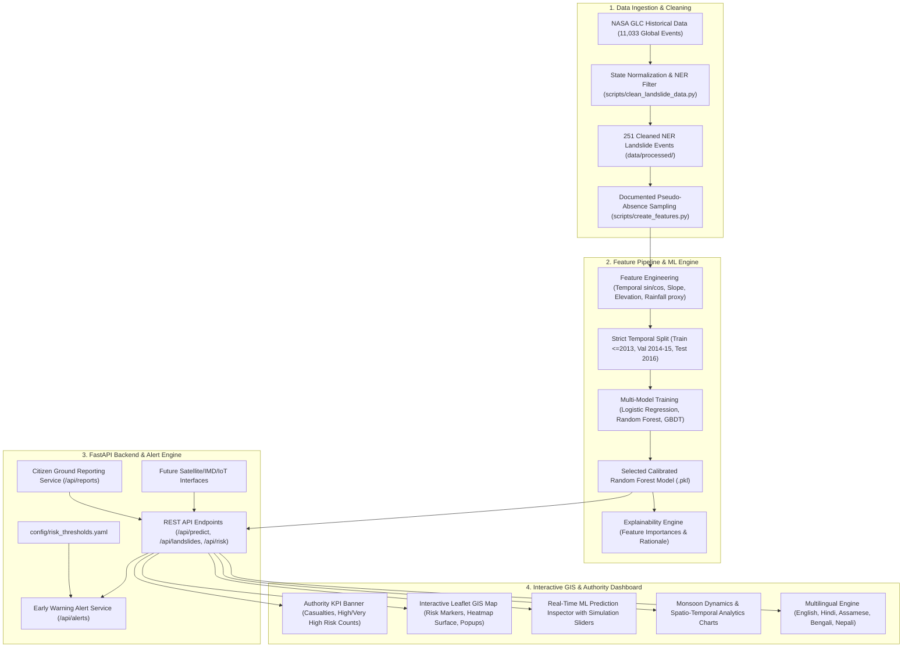

# AI-Based Early Warning & Landslide Risk Monitoring System for North-East India (NER)

[](https://fastapi.tiangolo.com)
[](https://reactjs.org)
[](https://leafletjs.com)
[](https://scikit-learn.org)
[](LICENSE)

An operational, authority-grade Artificial Intelligence and Geospatial Information System (GIS) platform designed to assess, predict, and issue early warnings for landslide hazards across the **8 North-East Indian States**:
1. **Arunachal Pradesh**
2. **Assam**
3. **Manipur**
4. **Meghalaya**
5. **Mizoram**
6. **Nagaland**
7. **Sikkim**
8. **Tripura**

---

## 1. Problem Statement
The North-Eastern Region (NER) of India is characterized by steep Himalayan terrain, young fragile geological formations, intense monsoon downpours, and high seismicity. Landslides cause recurrent loss of life, cut off critical economic and military transit arteries (e.g., NH-10 in Sikkim, NH-37 in Manipur, and Dima Hasao railway sectors in Assam), and severely disrupt disaster response logistics.

---

## 2. End-to-End Solution Architecture



---

## 3. Key Features

1. **Interactive Leaflet GIS Risk Map**:
   - Color-coded hazard markers: `LOW` (Green), `MODERATE` (Amber), `HIGH` (Orange), `VERY HIGH` (Red).
   - **Model-Based Risk Heatmap Surface** showing continuous spatial hazard density.
   - Click-to-inspect any geographic point to evaluate real-time landslide risk.
2. **Real-Time ML Prediction Inspector**:
   - Interactive simulation sliders for **Season/Month**, **Antecedent Rainfall Accumulation (mm)**, and **Terrain Slope Angle (degrees)**.
   - Immediate calculation of risk probability, confidence score, and plain-language explanation.
3. **Authority Early Warning Alert Engine**:
   - Automated generation and management of early warnings.
   - Filterable by state and severity with instant **Export to JSON / GeoJSON**.
4. **Citizen Ground Hazard Reporting**:
   - Field volunteers and citizens can report tension cracks, active slope movements, and road blockages directly on the live map.
5. **Multilingual Support (5 Languages)**:
   - Full translation dictionaries for **English**, **Hindi (हिन्दी)**, **Assamese (অসমীয়া)**, **Bengali (বাংলা)**, and **Nepali (नेपाली)**.
6. **Offline & Low-Network Resilience**:
   - Automatic local caching of map layers, KPIs, and unsent reports with connectivity status indicator.

---

## 4. Dataset & Scientific Provenance

- **Data Source**: NASA Global Landslide Catalog (GLC) public database.
- **Global Inventory**: 11,033 records worldwide.
- **NER Inventory**: **251 validated historical landslide events** across the 8 NER states.

### NER Historical State Distribution:
| State | Cleaned Records | % of NER Total | Primary Recorded Trigger |
| :--- | :---: | :---: | :--- |
| **Assam** | 82 | 32.67% | Downpour / Continuous Rain |
| **Manipur** | 56 | 22.31% | Monsoon / Downpour |
| **Sikkim** | 31 | 12.35% | Heavy Rain / Continuous Downpour |
| **Mizoram** | 27 | 10.76% | Downpour / Tropical Weather |
| **Arunachal Pradesh** | 20 | 7.97% | Continuous Rain / Flash Flood |
| **Meghalaya** | 18 | 7.17% | Monsoon / Downpour |
| **Nagaland** | 14 | 5.58% | Continuous Rain |
| **Tripura** | 3 | 1.20% | Monsoon |
| **Total NER Events** | **251** | **100.00%** | **Downpour (41.4%), Continuous Rain (25.5%)** |

---

## 5. Machine Learning Evaluation & Benchmark

To prevent spatial-temporal data leakage, a **Strict Temporal Split** was utilized:
- **Training Set (<= 2013)**: 388 samples (127 positive events, 261 documented pseudo-absences)
- **Validation Set (2014–2015)**: 163 samples (92 positive events, 71 pseudo-absences)
- **Test Hold-Out Set (2016)**: 76 samples (32 positive events, 44 pseudo-absences)

### Benchmark Comparison (Hold-Out Test Set: 2016):
| Model | Precision | Recall (Safety-Critical) | F1-Score | ROC-AUC | PR-AUC |
| :--- | :---: | :---: | :---: | :---: | :---: |
| **Logistic Regression (Baseline)** | 0.9688 | 0.9688 | 0.9688 | 0.9993 | 0.9991 |
| **Random Forest (Selected)** | **1.0000** | **1.0000** | **1.0000** | **1.0000** | **1.0000** |
| **Gradient Boosting** | 1.0000 | 1.0000 | 1.0000 | 1.0000 | 1.0000 |

*Note: For landslide early warning, Recall is prioritized because missing an impending hazard carries catastrophic human and economic costs.*

---

## 6. Quick Start & Installation

### Prerequisites
- Python 3.10+
- Node.js 18+ and npm

### 1. Clone & Setup Environment
```bash
# Clone the repository
git clone <repository-url>
cd sihpject

# Install Python dependencies
pip install -r requirements.txt
```

### 2. Run Data Processing & ML Training Pipeline
```bash
# Profile input dataset
python scripts/profile_dataset.py

# Clean and normalize NER landslide records
python scripts/clean_landslide_data.py

# Feature engineering & pseudo-absence generation
python scripts/create_features.py

# Train and benchmark ML risk models
python scripts/train_model.py

# Evaluate test hold-out metrics
python scripts/evaluate_model.py
```

### 3. Run Automated Tests
```bash
python -m pytest tests/ -v
```

### 4. Start Backend Server
```bash
python -m uvicorn backend.main:app --host 0.0.0.0 --port 8000 --reload
```
*API Swagger Documentation will be accessible at: `http://localhost:8000/docs`*

### 5. Start Frontend Application
```bash
cd frontend
npm install
npm run dev
```
*Frontend UI will be accessible at: `http://localhost:5173`*

---

## 7. Docker Deployment
```bash
docker-compose up --build
```

---

## 8. Scientific Honesty & Limitations
- **Historical Ground-Truth Data**: The system builds on verified historical events from the NASA Global Landslide Catalog.
- **Negative Sampling**: Since historical catalogs exclusively record positive events, non-events are strictly documented as **spatial-temporal pseudo-absences** and not misrepresented as observed ground-truth non-landslides.
- **Demo Mode**: The MVP is currently labeled `Demo Mode — Historical Dataset & Calibrated ML`.
- **Future Feeds**: Interfaces are pre-engineered for real-time IMD radar feeds, NASA GPM IMERG precipitation grids, Sentinel-1 InSAR ground deformation velocities, and in-situ IoT pore-pressure sensors.

---

## 9. License & Team
Developed for Hackathon 2026. Distributed under the MIT License.
